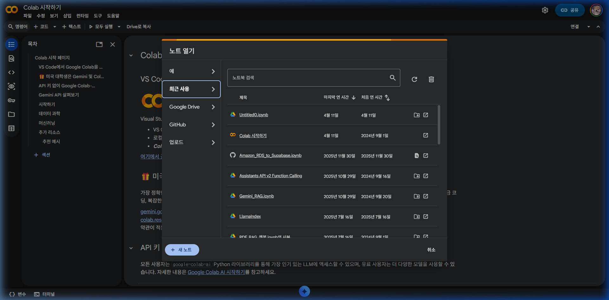
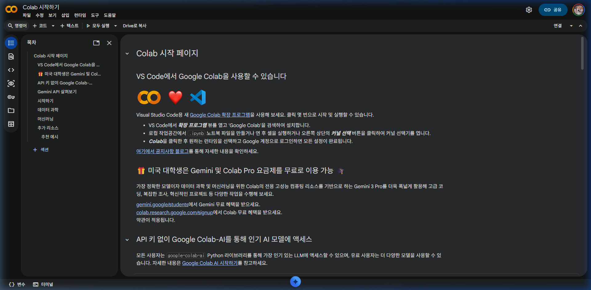
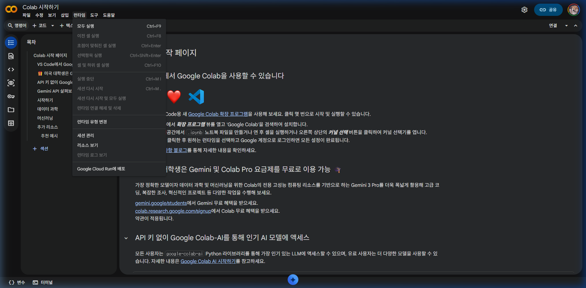
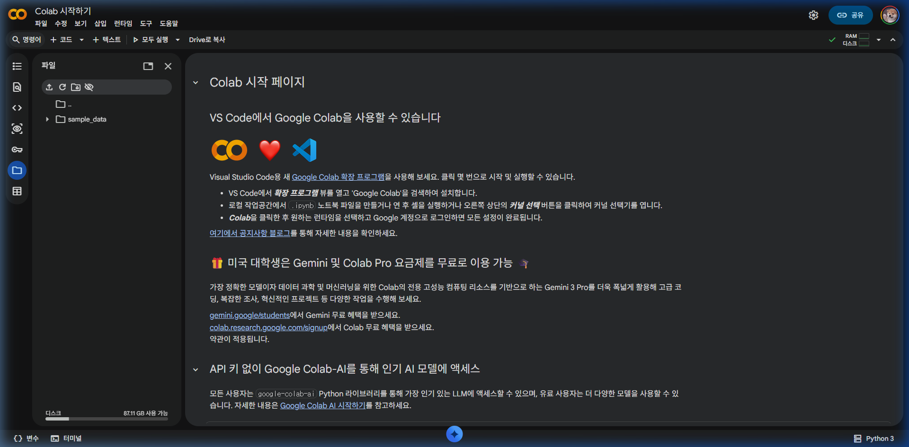

# [빅데이터 분석] 파이썬 개발 환경 구축: Google Colab 가이드

빅데이터 분석을 시작하기 위해 복잡한 로컬 환경 구축 대신, 구글에서 제공하는 클라우드 기반 서비스인 **Google Colab (Colaboratory)**을 활용합니다.

---

## 1. Google Colab이란?

Google Colab은 브라우저에서 직접 파이썬 코드를 작성하고 실행할 수 있는 서비스입니다. 

> [!TIP]
> **왜 빅데이터 분석에서 Colab을 사용하나요?**
> - **설치 불필요:** 브라우저만 있으면 어디서든 바로 사용 가능합니다.
> - **무료 GPU/TPU 지원:** 고성능의 하드웨어를 무료로 사용할 수 있어 딥러닝이나 복잡한 연산에 유리합니다.
> - **공유 및 협업:** Google Drive와 연동되어 문서를 쉽게 공유하고 동시에 편집할 수 있습니다.

---

## 2. 시작하기 (접속 및 파일 생성)

1. **사이트 접속:** [Google Colab](https://colab.research.google.com/)에 접속합니다.
2. **로그인:** 구글 계정으로 로그인합니다.
3. **새 노트 생성:** 왼쪽 상단의 `파일` > `새 노트`를 클릭하여 새로운 주피터 노트북(.ipynb)을 생성합니다.



---

## 3. 핵심 인터페이스 설명

- **코드 셀 (Code Cell):** 파이썬 코드를 입력하고 실행하는 곳입니다.
- **텍스트 셀 (Text Cell):** 마크다운(Markdown) 형식을 사용하여 설명이나 필기를 작성하는 곳입니다.
- **실행 단추:** 셀 왼쪽의 `▶` 버튼을 누르거나 `Ctrl + Enter`를 눌러 실행합니다.



---

## 4. 런타임 유형 변경 (GPU 가속 설정)

빅데이터 분석이나 머신러닝 모델 학습 시 연산 속도를 높이기 위해 GPU를 활성화해야 합니다.

1. 상단 메뉴의 **런타임** 클릭
2. **런타임 유형 변경** 선택
3. **하드웨어 가속기**에서 **T4 GPU** (또는 사용 가능한 GPU) 선택
4. **저장** 클릭



> [!IMPORTANT]
> GPU는 시스템 자원이 한정적이므로 사용하지 않을 때는 다시 'None'으로 변경하는 것이 좋습니다.

---

## 5. Google Drive 마운트 (데이터 연결)

데이터 분석을 위한 대용량 파일을 불러오기 위해 본인의 구글 드라이브와 연결해야 합니다.

다음 코드를 코드 셀에 입력하고 실행하세요:

```python
from google.colab import drive
drive.mount('/content/drive')
```

- 실행 후 나타나는 링크를 클릭하거나 팝업창에서 권한을 승인합니다.
- 좌측의 폴더 모양 아이콘을 클릭하면 `drive` 폴더가 생성된 것을 확인할 수 있습니다.



---

## 6. 필수 단축키 모음

| 단축키 | 기능 |
| :--- | :--- |
| **Ctrl + Enter** | 해당 셀 실행 |
| **Shift + Enter** | 해당 셀 실행 후 아래 셀로 이동 |
| **Alt + Enter** | 해당 셀 실행 후 아래에 새 셀 삽입 |
| **Ctrl + M B** | 아래에 코드 셀 추가 |
| **Ctrl + M A** | 위에 코드 셀 추가 |
| **Ctrl + M D** | 셀 삭제 |

---

## 7. 첫 번째 분석 테스트

환경 설정이 완료되었다면 아래 코드를 복사해서 실행해보세요.

```python
import pandas as pd
import numpy as np

# 데이터 생성
data = {
    '이름': ['김철수', '이영희', '박민수'],
    '점수': [85, 92, 78],
    '합격여부': [True, True, False]
}

df = pd.DataFrame(data)

# 결과 출력
print("### 판다스 데이터프레임 분석 예시 ###")
display(df)

# 평균 점수 계산
print(f"\n평균 점수: {df['점수'].mean():.2f}")
```

---

## 8. 노트북 저장 및 공유

- **저장:** 모든 작업물은 자동으로 Google Drive의 `Colab Notebooks` 폴더에 저장됩니다.
- **공유:** 우측 상단의 `공유` 버튼을 눌러 팀원이나 강사에게 링크를 전달할 수 있습니다.
