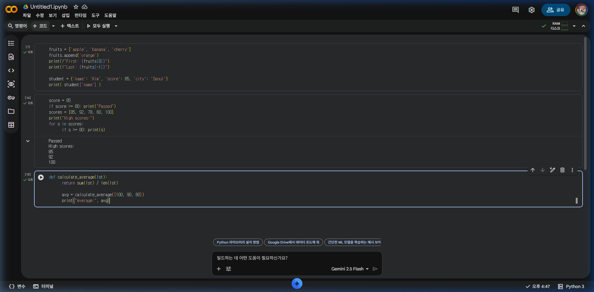
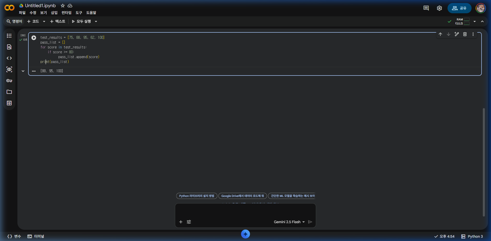

# [빅데이터 분석] Part 2: 빅데이터를 위한 파이썬 기초

빅데이터 분석을 본격적으로 시작하기 전, 데이터를 다루는 데 꼭 필요한 필수 파이썬 문법을 익힙니다. 

---

## 1. 데이터 저장소: 리스트(List)와 딕셔너리(Dictionary)

빅데이터 분석에서는 수많은 데이터를 담을 수 있는 바구니가 필요합니다.

### 1.1 리스트 (List)
순서가 있는 데이터의 집합입니다.
```python
# 리스트 생성
fruits = ['사과', '바나나', '체리']

# 데이터 추가
fruits.append('오렌지')

# 특정 위치 데이터 접근
print(fruits[0])  # 사과
print(fruits[-1]) # 오렌지 (마지막 요소)
```

### 1.2 딕셔너리 (Dictionary)
'키(Key)-값(Value)' 쌍으로 이루어진 데이터 구조로, JSON 형태의 데이터를 다룰 때 필수적입니다.
```python
# 딕셔너리 생성
student = {
    'name': '김철수',
    'score': 85,
    'city': '서울'
}

# 데이터 접근
print(student['name'])  # 김철수

# 새로운 정보 추가
student['grade'] = 'A'
```

---

## 2. 흐름 제어: 조건문과 반복문

데이터를 필터링하거나 수많은 데이터를 하나씩 꺼내볼 때 사용합니다.

### 2.1 조건문 (If)
```python
score = 85

if score >= 90:
    print("우수")
elif score >= 80:
    print("보통")
else:
    print("재시험")
```

### 2.2 반복문 (For)
데이터 분석에서 가장 많이 활용되는 구문입니다.
```python
scores = [85, 92, 78, 60, 100]

# 80점 이상인 점수만 출력하기
for s in scores:
    if s >= 80:
        print(f"합격 점수: {s}")
```

---

## 3. 코드의 재사용: 함수(Function)

반복되는 작업을 하나로 묶어 효율적으로 사용합니다.

```python
def calculate_average(data_list):
    avg = sum(data_list) / len(data_list)
    return avg

my_scores = [100, 90, 80]
print(f"평균 점수: {calculate_average(my_scores)}")
```

### 📊 파이썬 기초 문법 실행 결과 (Google Colab)

위의 리스트, 딕셔너리, 제어문 및 함수 코드를 실제 코랩에서 실행한 화면입니다.



---

## 4. 데이터 분석의 꽃: 라이브러리와 Import

파이썬이 데이터 분석 최강자인 이유는 강력한 외부 라이브러리 덕분입니다.

- **Numpy**: 행렬 및 수학 연산
- **Pandas**: 표 형태의 데이터 처리
- **Matplotlib**: 데이터 시각화

```python
# 라이브러리 불러오기 기초
import pandas as pd
import numpy as np

# 'as'는 별칭(Alias)으로, 코드를 짧게 쓰는 약속입니다.
```

---

## 💡 실습 과제

아래 코드를 실행하고 주석의 지시에 따라 코드를 완성해 보세요.

```python
# 1. 5명의 학생 점수가 담긴 리스트입니다.
test_results = [75, 88, 95, 62, 100]

# 2. 80점 이상인 점수만 골라 'pass_list'라는 새로운 리스트에 담는 코드를 작성하세요.
pass_list = []

for score in test_results:
    if score >= 80:
        pass_list.append(score)

print(f"합격자 명단: {pass_list}")
```

### ✅ 실습 과제 실행 결과

실습 과제의 정답 코드를 실행한 결과 화면입니다.


