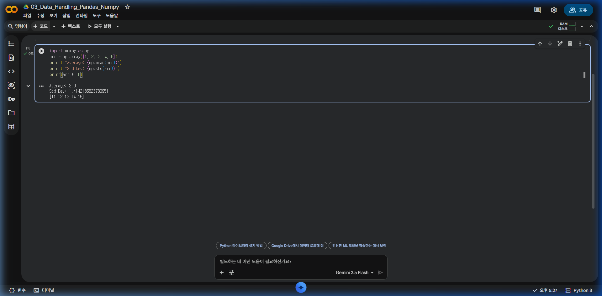
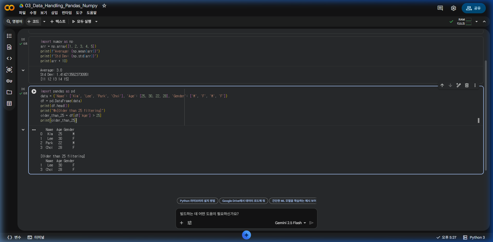
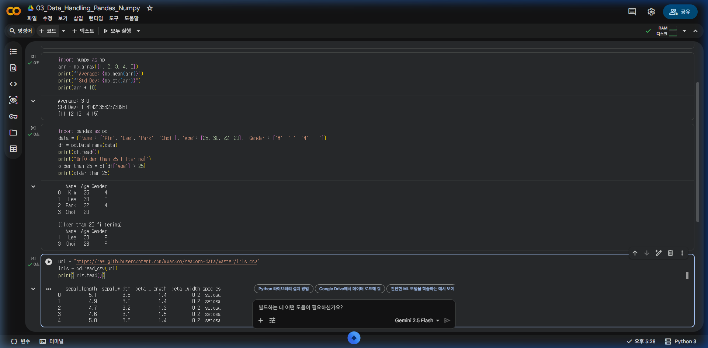
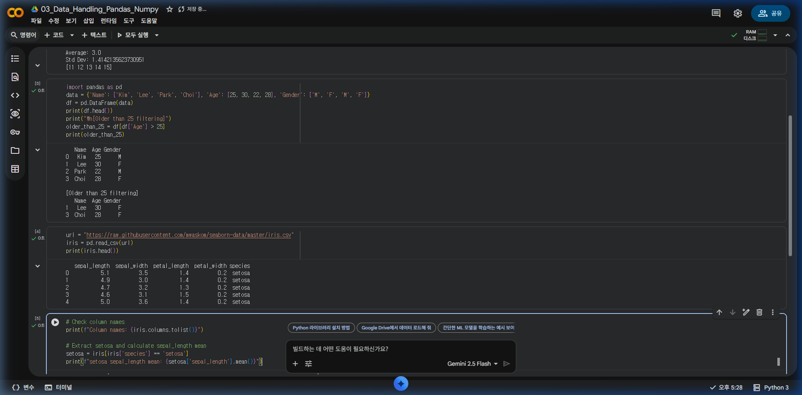

# [빅데이터 분석] Part 3: 데이터 다루기 (Pandas & Numpy)

수치 계산을 위한 **Numpy**와 데이터프레임 처리를 위한 **Pandas**는 파이썬 데이터 분석의 필수 도구입니다.

---

## 1. 수치 계산의 제왕, Numpy

Numpy는 대규모 다차원 배열과 행렬 연산에 최적화되어 있습니다.

```python
import numpy as np

# 1차원 배열 생성
arr = np.array([1, 2, 3, 4, 5])
print(f"평균: {np.mean(arr)}")
print(f"표준편차: {np.std(arr)}")

# 모든 원소에 10 더하기 (브로드캐스팅)
print(arr + 10)
```



---

## 2. 표 형태의 데이터, Pandas

Pandas는 엑셀과 같은 표 형식의 데이터(`DataFrame`)를 다루는 데 최적화되어 있습니다.

### 2.1 데이터프레임 생성 및 확인
```python
import pandas as pd

data = {
    '이름': ['김철수', '이영희', '박민수', '최지우'],
    '나이': [25, 30, 22, 28],
    '성별': ['남', '여', '남', '여']
}

df = pd.DataFrame(data)

# 상위 5개(기본값) 데이터 확인
print(df.head())

# 데이터 요약 정보 확인
print(df.info())
```

### 2.2 데이터 선택 및 필터링
```python
# 특정 열 선택
print(df['이름'])

# 조건에 맞는 행 필터링 (나이가 25세 초과인 경우)
older_than_25 = df[df['나이'] > 25]
print(older_than_25)
```



---

## 3. 외부 데이터 불러오기 (CSV)

대부분의 빅데이터는 CSV나 Excel 파일로 제공됩니다.

```python
# 구글 드라이브 마운트 후 파일 읽기 예시
# df = pd.read_csv('/content/drive/MyDrive/data.csv')

# 온라인 URL에서 직접 읽기 예시 (아이리스 데이터셋)
url = "https://raw.githubusercontent.com/mwaskom/seaborn-data/master/iris.csv"
iris = pd.read_csv(url)

print(iris.head())
```



---

## 4. 데이터 정제 기초

실제 데이터는 비어있거나(결측치) 잘못된 값들이 섞여 있습니다.

```python
# 결측치 확인
print(df.isnull().sum())

# 데이터 정렬 (나이순)
df_sorted = df.sort_values(by='나이', ascending=False)
print(df_sorted)
```

---

## 💡 실습 과제

제공된 `iris` 데이터셋을 활용하여 아래 질문의 코드를 작성하세요.

1. `iris` 데이터프레임의 전체 열 이름을 확인하세요 (`df.columns`).
2. `species`가 `setosa`인 데이터만 추출하여 별도의 변수에 저장하세요.
3. 추출된 데이터의 `sepal_length` 평균값을 구해보세요.

```python
# 전체 열 이름 확인
print(f"열 이름: {iris.columns.tolist()}")

# setosa 추출 및 sepal_length 평균
setosa = iris[iris['species'] == 'setosa']
print(f"setosa sepal_length 평균: {setosa['sepal_length'].mean()}")
```

### ✅ 실습 과제 실행 결과


