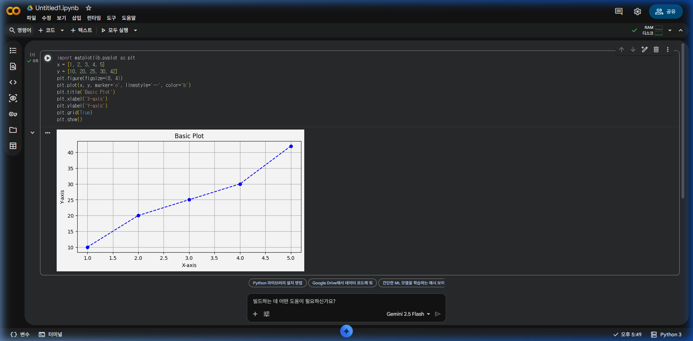
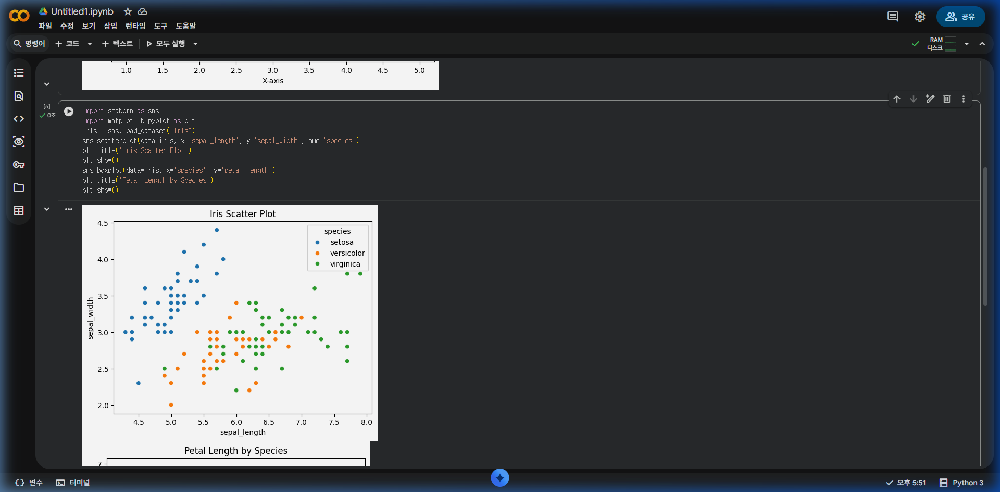
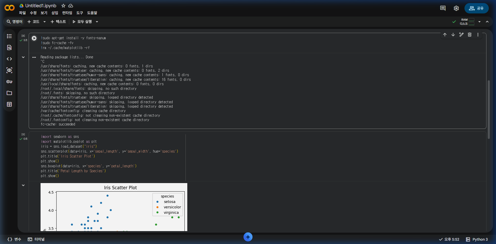
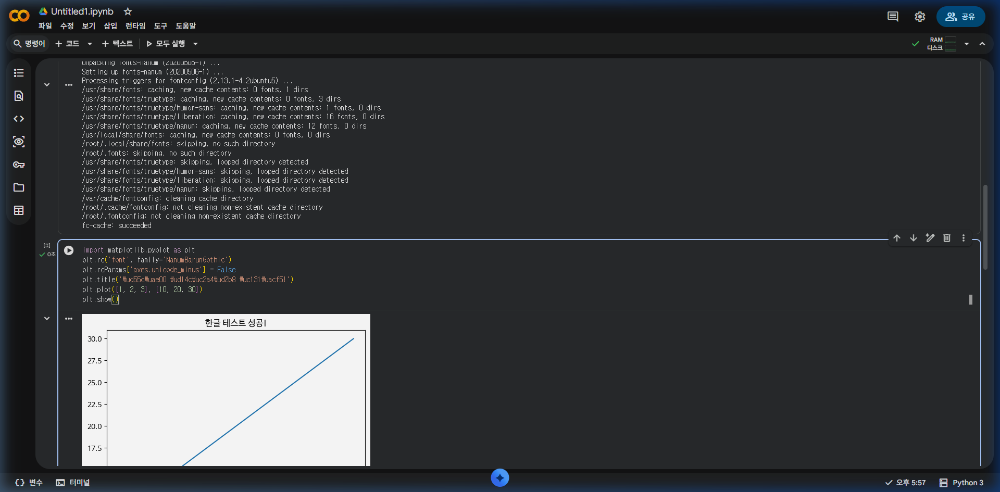

# [빅데이터 분석] Part 4: 데이터 시각화 기초

데이터 분석의 결과를 한눈에 이해하기 위해 그래프로 표현하는 과정입니다. 

---

## 1. 기본 그래프 그리기: Matplotlib

파이썬 시각화의 가장 기본이 되는 라이브러리입니다.

```python
import matplotlib.pyplot as plt

x = [1, 2, 3, 4, 5]
y = [10, 20, 25, 30, 42]

plt.figure(figsize=(8, 4))
plt.plot(x, y, marker='o', linestyle='--', color='b') # 선 그래프
plt.title('Basic Plot')
plt.xlabel('X-axis')
plt.ylabel('Y-axis')
plt.grid(True)
plt.show()
```



---

## 2. 화려한 통계 시각화: Seaborn

Pandas 데이터프레임과 잘 호환되며, 복잡한 통계 그래프를 쉽게 그릴 수 있습니다.

```python
import seaborn as sns

# 아이리스 데이터 로드
iris = sns.load_dataset("iris")

# 산점도(Scatter Plot)에 카테고리별 색상 입히기
sns.scatterplot(data=iris, x='sepal_length', y='sepal_width', hue='species')
plt.title('Iris Scatter Plot')
plt.show()

# 박스 플롯(Box Plot)
sns.boxplot(data=iris, x='species', y='petal_length')
plt.title('Petal Length by Species')
plt.show()
```



---

## 3. Google Colab에서 한글 폰트 설정하기 (필수!)

Colab은 기본적으로 한글 폰트가 설치되어 있지 않아 그래프에서 한글이 깨집니다. 아래 코드를 실행하여 설정을 완료하세요.

> [!IMPORTANT]
> 아래 코드를 실행한 후, 상단 메뉴의 **[런타임] > [세션 다시 시작]**을 눌러야 폰트가 적용됩니다.

```python
# 1. 나눔 폰트 설치
!sudo apt-get install -y fonts-nanum
!sudo fc-cache -fv
!rm ~/.cache/matplotlib -rf

# 2. 설치 후 세션 다시 시작 (런타임 다시 시작) 필수!
```



**[런타임 다시 시작 후 실행할 코드]**
```python
import matplotlib.pyplot as plt

# 나눔바른고딕 폰트 설정
plt.rc('font', family='NanumBarunGothic') 

# 마이너스 기호 깨짐 방지
plt.rcParams['axes.unicode_minus'] = False

# 확인 테스트
plt.title('한글 테스트 성공!')
plt.plot([1, 2, 3], [10, 20, 30])
plt.show()
```



> [!WARNING]
> **💡 트러블슈팅(Troubleshooting): 한글이 네모(ㅁㅁㅁ)로 깨지거나 폰트 오류(findfont)가 발생할 때 해결 방법**
> 
> Colab 환경에서 폰트 설치 코드를 실행했음에도 불구하고 한글이 깨지거나 `Font family ['NanumBarunGothic'] not found` 오류가 발생하는 경우가 자주 있습니다.
> 이 때는 아래 절차를 따라 수정해 주시기 바랍니다.
> 1. 설치 코드에 있는 `!rm ~/.cache/matplotlib -rf` 가 정상적으로 실행되어 이전 폰트 캐시가 삭제되었는지 확인합니다.
> 2. **(가장 중요)** 상단 메뉴의 **[런타임] > [세션 다시 시작(Restart session)]**을 반드시 한 번 더 클릭하세요. 이 과정을 무시하면 삭제한 캐시가 갱신되지 않습니다. 
> 3. 만약 `NanumBarunGothic` 이 여전히 동작하지 않는다면, 코드를 `plt.rc('font', family='NanumGothic')` 로 변경하여 시도해 보세요.
> *테스트 진행 시 캐시가 꼬이거나 실행 순서가 엇갈릴 때 발생하는 대표적인 오류이며, 세션 초기화 및 재설치로 대부분 해결됩니다.*

---

## 💡 실습 과제

1. 임의의 데이터(예: 본인의 월도별 생활비)를 리스트로 만들어 **막대 그래프(`plt.bar`)**를 그려보세요.
2. `iris` 데이터셋의 `species`별 `sepal_length`의 **히스토그램(`sns.histplot`)**을 그려보세요.
3. 그래프의 제목과 축 이름에 한글이 깨지지 않고 나오는지 확인하세요.
